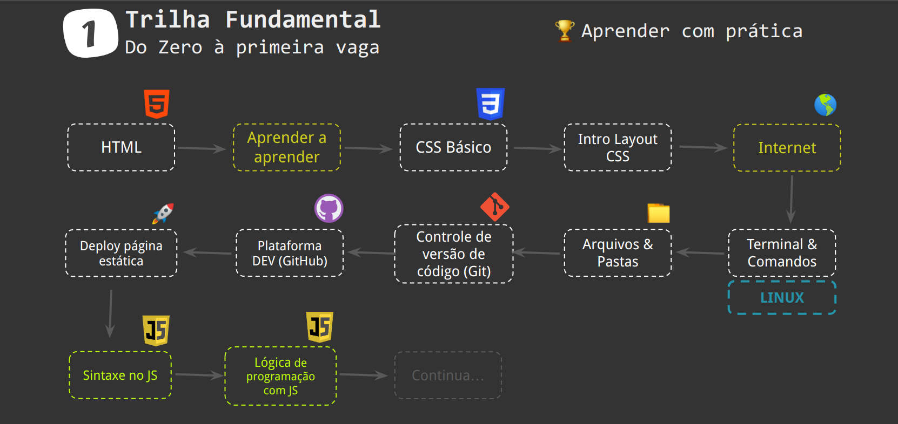

# guia-definitivo-do-zero-a-primeira-vaga

## **Motivações**

- Back ou Front?
- Sempre alguém afirma que tem que aprender algo
- Aprender framework antes dos fundamentos
- Não separar a sintaxe da lógica de programação
- Não separar JS e JS para páginas web
- Hard vs Soft Skills
- Aprender fazendo algo real

## FUNDAMENTAL - Tabela de Conteúdo

- [Aprender a aprender](#aprender-a-aprender)

  - [Defina um objetivo claro](#wip)
  - [Defina sua Agenda](#wip)
  - [Caminhada das Imagens (Picture Walk)](#wip)
  - [Modo Focado versus Difuso](#wip)
  - [Como evitar a procrastinação](#wip)
  - [Aprendendo enquanto você dorme](#wip)
  - [O Conhecimento entra pelos dedos](#wip)
  - [O poder das comunidades](#wip)

- [HTML](#html)

  - [Introdução ao HTML](#introdução-ao-html)
  - [Ferramentas necessárias](#ferramentas-necessárias)
  - [Olá mundo com HTML](#olá-mundo-com-html)
  - [Visão geral das TAGs do HTML](#visão-geral-das-tags-do-html)
  - [As principais TAGS do HTML](#as-principais-tags-do-html)
  - [🏆 Entendendo marcações HTML na prática](#🏆-entendendo-marcações-html-na-pratica)
  - [Tags e seus atributos](#tags-e-seus-atributos)
  - [Estrutura, DOM e a anatomia de uma página HTML](#estrutura-dom-e-a-anatomia-de-uma-página-html)
  - [Formulários e campos para obter dados](#formulários-e-campos-para-obter-dados)

- [CSS Básico](#css-basico)

  - [Motivações para entender CSS](#wip)
  - [O que é Cascading Style Sheets (CSS)](#wip)
  - [🏆 CSS na prática](#wip)
  - [🏆 Estilo inline, Tag Style e arquivos externos](#wip)
  - [Aprendendo CSS criando uma página web](#wip)
  - [Estilo em textos](#wip)
  - [🏆 Estilo no título #3.1](#wip)
  - [🚀 Dica DEV #1 - Editor de código](#wip)
  - [Introdução aos seletores CSS](#wip)
  - [Tipos de seletores](#wip)
  - [Especificidade de seletores CSS](#wip)
  - [Visão geral dos seletores CSS](#wip)
  - [Cascata nos seletores nem sempre funcionam](#wip)
  - [🏆 Mais estilo nos textos #3.2](#wip)
  - [🚀 Dica DEV #2 - Codepen](#wip)
  - [🏆 Formatando links e botões #3.3](#wip)
  - [🚀 Dica DEV #3 - Chrome Dev Tools](#wip)
  - [🏆 Alinhar textos e espaçamentos #3.4](#wip)
  - [Entendendo a unidade px (pixels)](#wip)
  - [🏆 Tamanho e posicionar imagem #3.5](#wip)
  - [Depuração no CSS (debugging)](#wip)
  - [Entendendo a tag 
](#wip)
  - [🏆 Estilo de lista e cor de fundo #3.6](#wip)
  - [Entendendo cores no CSS](#wip)
  - [🏆 Estilo da barra de progresso #3.7](#wip)
  - [🏆 Formatar o rodapé #3.8](#wip)
  - [🏆 Importar fonte web #3.9](#wip)
  - [Entendendo o reset.css](#wip)
  - [Propriedade abreviada (shorthand wheel)](#wip)

- [Intro Layout CSS](#intro-layout-css)

  - [Normal flow](#wip)
  - [Box-model](#wip)
  - [Containers com divs](#wip)
  - [20% do flexbox para resolver 80% dos seus problemas](#wip)

- [Internet](#internet)

  - [Como funcionam as páginas web](#como-funcionam-as-páginas-web)
  - [URL ou Link: você sempre usa, mas não prestou atenção](#wip)
  - [Domínio, IP e Domain Server Name (DNS)](#wip)
  - [Página web estática](#pagin-web-estatica)](#wip)

- [Terminal & Comandos](#terminal-&-comandos)

  - [WIP](#wip)

- [Arquivo & Pastas](#arquivo-&-pastas)

  - [Organização de pastas & arquivos](#organização-pastas-&-arquivos)
  - [Estrutura de pastas e arquivos](#estrutura-de-pastas-e-arquivos)
  - [Navegando em pastas](#navegando-em-pastas)
  - [Organizando projetos](#organizando-projetos)

- [Controle de versão de código (Git)](#wip)

  - [Viagem no tempo e intro ao controle de versão de código](#wip)
  - [Iniciando com Git](#wip)
  - [Transformando uma pasta em um repositório de versões](#wip)
  - [Gerando commit (foto do estado atual)](#wip)
  - [Navegando entre versões](#wip)
  - [Git Stages](#wip)

- [Plataforma Dev (GitHub)](#wip)

  - [Criar conta no Github](#wip)
  - [Chave SSH para acesso completo](#wip)
  - [Criando meu primeiro repositório](#wip)
  - [Sincronizando código local com repositório do GitHub](#wip)
  - [Conectando novo repositório com pasta existente](#wip)

- [Deploy página web estática](#wip)

  - [Github Pages](#wip)

- [Sintaxe do JS](#wip)

  - [Sintaxe vs Lógica de programação](#wip)
  - [Onde rodar código JS?](#wip)
  - [Comentários de código](#wip)
  - [🚀 Dica DEV: Como utilizar o interpretador NodeJS](#wip)
  - [Sintaxe e caracteres](#wip)
  - [Case sensitivity](#wip)
  - [Tipos de dados (Data Types)](#wip)
  - [🏆 Crie uma variável z que é a soma de x + y](#wip)
  - [Declaração e atribuição de variáveis](#wip)
  - [🏆 crie uma variável nomeDoCarro e atribua o valor "Volvo”](#wip)
  - [Escopos (var, let e const)](#wip)
  - [Palavras reservadas](#wip)
  - [Operadores aritméticos](#wip)
  - [🏆 Qual uma alternativa para atribuir x = x \* y?](#wip)
  - [🏆 Como atribuir um número aleatório na variável r?](#wip)
  - [Tipo String e suas operações](#wip)
  - [🏆 Crie uma variável com o tamanho de let texto = "Olá Mundo"](#wip)
  - [🏆 Converta a variável texto para maiúsculo](#wip)
  - [String como Array (bracket notation)](#wip)
  - [Conversão de Tipos (casting)](#wip)
  - [Desvios condicionais (if, if else, else)](#wip)
  - [Operador de igualdade (equality & strict equality)](#wip)
  - [Operador de desigualdade](#wip)
  - [Operações lógicas e tabela verdade](#wip)
  - [🏆 Imprima true quando x = 10 for maior que y = 5](#wip)
  - [🏆 Corrigir o condicional](#wip)
  - [Repetições (for, for in, for of e forEach)](#wip)
  - [🏆 Desafios D12, D13 e D14](#wip)
  - [Repetições (break e continue)](#wip)
  - [Repetições (while, do while)](#wip)
  - [🏆 Desafios D15 e D16](#wip)

- [Lógica de programação com JS](#wip)

  - [🏆 Desafios Lista 1 e Lista 2](#wip)

- [Uma pouco mais de JS](#wip)
  - [Iniciando com funções (functions) no JS](#wip)
  - [Primeiros passos com Objetos no JS](#wip)
